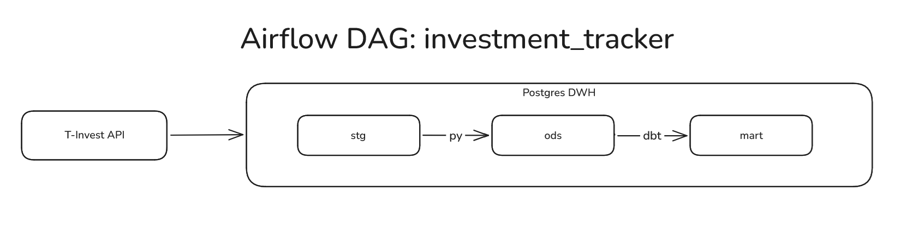

# investment_tracker
ELT-пайплайн отслеживания выплат купонов по облигациям. Данные забираются из T-Invest API, далее приводятся к нужным
типам и загружаются в **слой stg**, который постоянно перезаписывается. Из стэйджинг-слоя данные поступают
в **слой ods** с помощью upsert и уже в нём хранятся исторически. Далее через **dbt** организовано инкрементальное
построение витрины в **слое mart** со статусами по каждому купону.

## Архитектура


## Варианты пайплайна
| Файл | Что это | Когда использовать |
|------|---------|--------------------|
| `dags/t_invest_dbt.py` | основной DAG, витрина через dbt | по умолчанию |
| `dags_without_dbt/t_invest_clean.py` | тот же пайплайн, витрина чистым SQL из `sql/` | нет dbt / сравнить подходы |

**Важно:** у обеих версий DAG одинаковый `dag_id` — переключение выполняется
*заменой* файла в `dags/`.

## Стек
- Airflow 3.3.0 — оркестрация
- T-Bank Invest API (`t-tech-investments`) — источник
- PostgreSQL — хранилище (stg + ods + mart)
- dbt (dbt-postgres) — моделирование витрины и тесты
- Docker Compose — поднятие стека локально

## Ключевые функции
- Инкрементальность: stg перезагружается целиком (truncate + insert), 
ods обновляется upsert'ом по первичным ключам, mart собирается dbt-моделью с инкрементальной материализацией
по составному ключу bond_figi + planned_payment_date
- Идемпотентность: повторный прогон дага не создаёт дублей — stg чистится перед загрузкой, в ods вставка идёт
через ON CONFLICT DO UPDATE, витрина обновляется по unique_key
- Две версии пайплайна: основная на dbt и вариант без dbt, где витрина собирается 
ручным SQL-запросом (insert ... on conflict)

## Запуск
1. Положить российский корневой сертификат в `certs/russian_trusted_root_ca.pem`
 (нужен для gRPC-подключения к API T-Bank)
2. Создать `.env` в папке проекта:
 - `POSTGRES_USER`, `POSTGRES_PASSWORD`, `POSTGRES_DB` — параметры БД проекта
 - `T_INVEST_TOKEN` — токен T-Bank API (для локальных экспериментов; основной
   даг берёт токен из connection)
3. Выполнить `sql/ddl.sql` в Postgres — создаёт схемы и таблицы stg и ods
 (витрину mart создаст dbt при первом запуске)
4. `docker compose up -d --build`
5. В веб-интерфейсе Airflow создать connections:
 - `local_db_postgres`: тип Postgres, host `my_db` (имя сервиса БД в compose),
   порт 5432, schema `investment_tracker`, логин/пароль из `.env`
 - `t_invest_token`: токен T-Bank API в поле Password
6. Запустить DAG `investment_tracker`
7. Проверить витрину:
```sql
select bond_name, planned_payment_date, amount, payment_status
from mart.coupons_payments_status
order by planned_payment_date;
```
Результат:

| bond_name | planned_payment_date | amount | payment_status |
|-----------|---------------------|--------|----------------|
| Сбербанк 001Р-SBER51 | 2026-01-15 | 61.0500 | Да |
| ФПК 002Р-01 | 2026-01-22 | 63.3000 | Да |
| Газпром капитал БО-003Р-07 | 2026-01-25 | 72.0500 | Да |

## Модель данных
- `stg` — буфер выгрузки из API, перезагружается на каждом прогоне. Приведение типов
  (даты, деньги из формата API) выполняется в коде дага до загрузки. Состав таблиц совпадает с ods.
- `ods` — исторический слой, дедупликация по первичным ключам:
  - `bonds` (PK `bond_figi`) — справочник облигаций: тикер, тип, номинал, сектор,
    дата погашения, дата первой покупки, признак «в портфеле»
  - `coupons` (PK `bond_figi` + `coupon_date`) — график купонов
  - `portfolio_snapshots` (PK `snapshot_date` + `bond_figi`) — ежедневные срезы портфеля
  - `coupons_payments` (PK `operation_id`) — факты выплат из операций
- `mart.coupons_payments_status` — статус каждой выплаты по купону: `bond_figi`, `ticker`,
  `bond_name`, `planned_payment_date`, `actual_payment_date`, `first_purchase_date`,
  `is_in_portfolio`, `payment_status`, `amount`, `updated_at`.
  Уникальность строк — `bond_figi` + `planned_payment_date` (unique_key dbt)